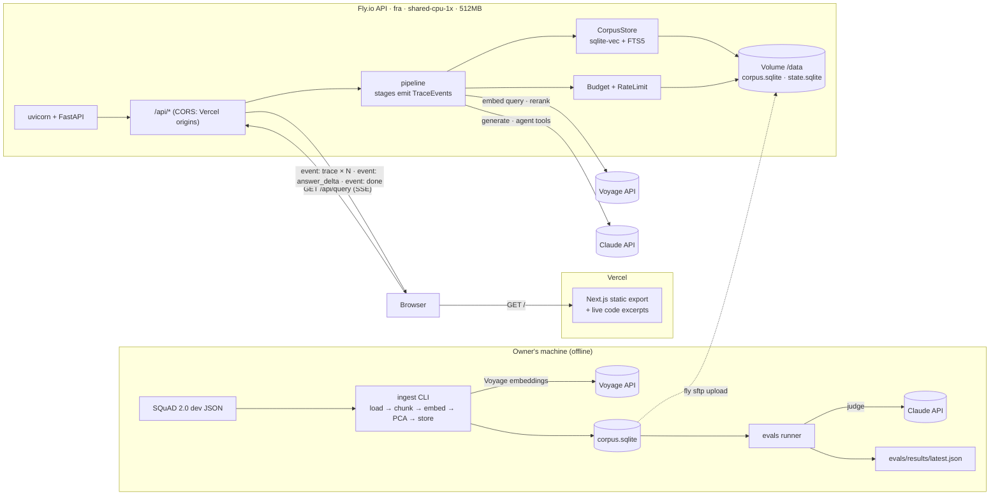

# highnet-rag — Architecture

Decisions come from [`PROJECT_BRIEF.md`](PROJECT_BRIEF.md). This document describes _how_ they are built. Rule zero: **if a stage runs, it emits a trace event.**

## 1. Overview



**Two origins (owner decision, 2026-09-28).**

- The web app is a static export deployed on Vercel.
- The API runs on Fly.io. It allows the Vercel production domain (`CORS_ORIGINS`) and preview deployments (`CORS_ORIGIN_REGEX`) with GET-only CORS.
- The browser finds the API through `NEXT_PUBLIC_API_BASE`, set in the Vercel project.
- Locally, `highnet-rag serve` can still serve `web/out` itself (same origin, no CORS needed).

## 2. Repository layout

```
/                     AGENTS.md, CLAUDE.md, PRODUCT.md, DESIGN.md, README.md, LICENCE.md
                      pyproject.toml (uv workspace: api, evals), Dockerfile, fly.toml, .env.example
/api                  FastAPI app + ingestion (Python package `highnet_rag`)
  src/highnet_rag/
    app.py            FastAPI factory, routes, static mount
    config.py         Settings (pydantic-settings) – every env var, validated once
    trace.py          TraceEvent model, Tracer (timing, sequencing, cost roll-up)
    pricing.py        price table per model (env-overridable), cost_usd()
    budget.py         spend ledger, monthly caps, per-IP rate limiting
    providers/        voyage.py, claude.py – lazily constructed clients
    storage/          base.py (Protocols), sqlite.py (sqlite-vec + FTS5)
    pipeline/         stages.py (one function per stage), classic.py, agentic.py
    ingest/           squad.py (load), chunk.py, embed.py, pca.py, cli.py
  tests/              pytest; fake providers, tiny fixture corpus
/web                  Next.js App Router, static export
  app/                page.tsx (pipeline explorer), evals/page.tsx, layout.tsx, globals.css
  components/ui/      restyled shadcn primitives (PascalCase) + Button, Typography
  components/pipeline/ StepSheet, WhyThisStep, SettingsStrip, RankTable, CorpusMap, …
  lib/                trace.ts (generated types), useTraceStream.ts, utils.ts (cn)
/evals                golden sets, runner, metrics; publishes results/latest.json
/docs                 PROJECT_BRIEF.md, ARCHITECTURE.md, MILESTONES.md
/data                 (gitignored) raw SQuAD JSON, built corpus.sqlite
```

## 3. Backend components

| Component             | Responsibility                                                                                                                                                                                                                                                                         |
| --------------------- | -------------------------------------------------------------------------------------------------------------------------------------------------------------------------------------------------------------------------------------------------------------------------------------- |
| `config.Settings`     | Reads and validates every env var at startup (see `.env.example`). Missing API keys do **not** crash startup; they fail the first request that needs them, as a clean `error` trace event.                                                                                             |
| `providers.voyage`    | `embed(texts, input_type)` and `rerank(query, docs, top_k)` over Voyage's REST API with plain `httpx` (the `voyageai` SDK pulls in LangChain and tokenizers). Each returns results plus token usage. The HTTP client is built lazily on first use (AGENTS.md rule).                    |
| `providers.fake`      | Deterministic offline stand-ins (`FAKE_PROVIDERS=true`, `ingest --fake`): hashed bag-of-words embeddings and an extractive "LLM". No keys and no cost; every event names `provider: "fake"` and the UI labels runs as illustrative.                                                    |
| `providers.claude`    | `count_tokens`, `stream_answer` (streaming, with citations), `agent_turn` (tool use). The client is built lazily. Model IDs come from settings.                                                                                                                                        |
| `storage.CorpusStore` | A read-only Protocol: `chunk_sets()`, `bm25(query, set, k)`, `knn(vector, set, k)`, `chunks(ids)`, `map_points(set)`, `pca(set)`, `meta()`. `SqliteCorpusStore` implements it today; a `PgvectorCorpusStore` can implement it later without touching the pipeline.                     |
| `storage.StateStore`  | A writable Protocol: `record_spend(...)`, `month_spend()`, `record_run(...)`, `hits(ip_hash, window)`. It lives in a separate `state.sqlite`, so the corpus file can be swapped atomically.                                                                                            |
| `budget`              | Pre-flight checks (rate limit, monthly budget, degradation tier) and post-call spend recording. Its decisions are emitted as the `request` stage.                                                                                                                                      |
| `pipeline.classic`    | Runs the fixed stage sequence (§4) for one query.                                                                                                                                                                                                                                      |
| `pipeline.agentic`    | A manual Claude tool-use loop with the tools `search(query, mode, k)` and `answer()`, capped at `AGENT_MAX_STEPS`. Each tool call runs the retrieval stages again and emits them with a `parent` step. It is a manual loop, not the SDK tool runner, so every turn is a visible stage. |
| `trace.Tracer`        | A context manager per stage. It measures `ms`, assigns `seq`, attaches `tokens` and `cost_usd`, catches exceptions and turns them into an `error` event, and yields events onto the SSE queue.                                                                                         |

No LangChain or similar framework. Each stage is a plain function: `(inputs) -> (outputs, TraceEvent)`.

## 4. Pipeline stages & the trace-event schema

### Stage sequence (classic mode)

| seq | `stage`                    | Emitted when                                                         | `data` (main fields)                                                                                                                                                            |
| --- | -------------------------- | -------------------------------------------------------------------- | ------------------------------------------------------------------------------------------------------------------------------------------------------------------------------- |
| 1   | `request`                  | always                                                               | `run_id`, echoed `settings`, `model`, `rate_limit` {remaining_min, remaining_day}, `budget` {spent_usd, cap_usd, tier: `normal`\|`degraded`\|`stopped`}                         |
| 2   | `embed_query`              | mode ∈ {vector, hybrid}; skipped in BM25 mode (no embedding call)    | `model`, `dims`, `input_type: "query"`, `vector_preview` (first 8 dims), `norm`, `retries`                                                                                      |
| 3   | `map_project`              | when there is a query embedding; otherwise skipped                   | `x`, `y` of the query in the chunk set's PCA space, `explained_variance`, `neighbours_2d` (the 5 nearest chunk ids in 2D)                                                       |
| 4   | `bm25`                     | mode ∈ {bm25, hybrid}; otherwise `status: "skipped"`                 | `fts_query` (the FTS5 MATCH string actually run: distinct non-stopword terms, each quoted), `terms`, `depth`, `results` [{chunk_id, rank, score (higher is better), doc_title}] |
| 5   | `vector`                   | mode ∈ {vector, hybrid}; otherwise skipped                           | `metric: "cosine"`, `depth`, `results` [{chunk_id, rank, distance, doc_title}]                                                                                                  |
| 6   | `fuse`                     | mode = hybrid; otherwise skipped. Each search then fetches 2 × top-k | `method: "rrf"`, `k: 60`, `kept` (top-k), `results` [{chunk_id, rank, score, doc_title, from: {bm25_rank, vector_rank}, contributions: {bm25, vector}}]                         |
| 7   | `rerank`                   | reranker on; otherwise skipped                                       | `model`, `before` [{chunk_id, rank}], `after` [{chunk_id, rank, relevance}], `moved` (rank deltas)                                                                              |
| 8   | `select_context`           | always                                                               | `top_k`, `ranking` (`bm25`\|`vector`\|`fuse`), `score_name`, `chunks` [{chunk_id, rank, doc_title, score, text, approx_tokens}], `context_tokens_approx`                        |
| 9   | `prompt`                   | always                                                               | `system`, `messages` (the exact request body minus the API key), `input_tokens` (from `count_tokens`), `max_tokens`, `worst_case_cost_usd`                                      |
| 10  | `generate`                 | always                                                               | `model`, `stop_reason`, `usage` {input_tokens, output_tokens, cache_read_input_tokens}, `answer`                                                                                |
| 11  | `citations`                | always                                                               | `citations` [{block, chunk_id, doc_title, rank, cited_text}], `blocks` (answer text with citation markers), `unused_chunk_ids`, `abstained`                                     |
| 12  | `done` (SSE `event: done`) | always, last                                                         | totals: `ms`, `tokens`, `cost_usd`, `stages`                                                                                                                                    |

**Agentic mode** replaces 2–9 with:

- `agent_plan`: the model's first turn, with rewritten sub-queries;
- then, per tool call, `agent_step` (tool name + input), followed by that call's retrieval stages (`embed_query`, `bm25`, …), each carrying `parent: "<agent_step id>"` and a step label (`4a`, `4b`, …);
- then `generate` and `citations` as usual.

`AGENT_MAX_STEPS` (default 4) and the per-query token cap are enforced and shown in the trace.

### TraceEvent (SSE `event: trace`)

The base shape is the one fixed in the brief, plus bookkeeping fields:

```json
{
  "run_id": "01J…",
  "seq": 5,
  "stage": "vector",
  "status": "ok",
  "parent": null,
  "label": "5",
  "data": { "metric": "cosine", "results": [{ "chunk_id": 812, "rank": 1, "distance": 0.214 }] },
  "ms": 42,
  "tokens": 0,
  "cost_usd": 0
}
```

| Field      | Type                                      | Meaning                                                                                                                                      |
| ---------- | ----------------------------------------- | -------------------------------------------------------------------------------------------------------------------------------------------- |
| `run_id`   | string (ULID)                             | One per query                                                                                                                                |
| `seq`      | int                                       | Order of emission; the client sorts by it                                                                                                    |
| `stage`    | enum                                      | See the table above                                                                                                                          |
| `status`   | `ok` \| `skipped` \| `error` \| `warning` | `skipped` always carries `data.reason`; `error` carries `data.error` {type, message}; `warning` is ok with a caveat, such as a low top score |
| `parent`   | string \| null                            | Parent `agent_step` id in agentic mode                                                                                                       |
| `label`    | string                                    | The human step number shown on the pad ("5", "4b")                                                                                           |
| `data`     | object                                    | Stage-specific payload; each stage has its own Pydantic model                                                                                |
| `ms`       | int                                       | Wall time of this stage                                                                                                                      |
| `tokens`   | int                                       | Tokens billed by this stage (embedding, rerank, or LLM input + output)                                                                       |
| `cost_usd` | float                                     | Cost of this stage from `pricing.py`, rounded to 6 decimal places                                                                            |

The other SSE events are:

- `event: answer_delta`: `{run_id, text}` while `generate` streams. This is a UI convenience; the full answer is still in the `generate` trace event.
- `event: done`: the totals.
- A `: keep-alive` comment every 15 s.

The Pydantic models are the source of truth. `uv run highnet-rag schema` exports JSON Schema to `web/lib/generated/trace.schema.json`, and `json-schema-to-typescript` turns that into `web/lib/generated/trace.ts`. CI fails if the generated files are stale.

## 5. HTTP endpoints

| Method & path                    | Returns             | Notes                                                                                                                                                                                                                                                                                |
| -------------------------------- | ------------------- | ------------------------------------------------------------------------------------------------------------------------------------------------------------------------------------------------------------------------------------------------------------------------------------ |
| `GET /api/query`                 | `text/event-stream` | Query params: `q` (≤ 500 chars), `mode` (`bm25`\|`vector`\|`hybrid`, default `hybrid`), `k` (1–10), `chunk_set` (name: `small`\|`medium`\|`large`); later `rerank` (bool) and `agentic` (bool). GET makes it work with `EventSource`. The response is not cached and not compressed. |
| `GET /api/config`                | JSON                | Allowed settings, chunk sets, defaults, suggested questions, the models in use, and the current budget tier.                                                                                                                                                                         |
| `GET /api/corpus/map?chunk_set=` | JSON                | `[{chunk_id, x, y, doc_id}]` for the 2D map. Immutable per corpus build (ETag = build id).                                                                                                                                                                                           |
| `GET /api/chunks/{id}`           | JSON                | Chunk text, document title, character offsets, and neighbouring chunk ids                                                                                                                                                                                                            |
| `GET /api/evals`                 | JSON                | The latest published eval results, or 404 before the first run                                                                                                                                                                                                                       |
| `GET /api/health`                | JSON                | Liveness plus corpus build id; used by Fly health checks                                                                                                                                                                                                                             |
| `GET /*`                         | static              | `web/out`, with `index.html` fallbacks for the static routes                                                                                                                                                                                                                         |

## 6. SQLite schema

**`corpus.sqlite`**: built locally and read-only in production.

```sql
CREATE TABLE meta (key TEXT PRIMARY KEY, value TEXT NOT NULL);
-- build_id, built_at, embed_model, embed_dims, corpus ('squad-2.0-dev'), licence ('CC BY-SA 4.0'), source_url

CREATE TABLE documents (
  id INTEGER PRIMARY KEY,
  title TEXT NOT NULL,
  text TEXT NOT NULL,              -- full article text (paragraphs joined by \n\n)
  source_url TEXT NOT NULL
);

CREATE TABLE chunk_sets (
  id INTEGER PRIMARY KEY,
  name TEXT NOT NULL UNIQUE,       -- 'small' | 'medium' | 'large'
  target_tokens INTEGER NOT NULL,  -- ~100 | ~250 | ~500
  overlap_tokens INTEGER NOT NULL
);

CREATE TABLE chunks (
  id INTEGER PRIMARY KEY,
  chunk_set_id INTEGER NOT NULL REFERENCES chunk_sets(id),
  doc_id INTEGER NOT NULL REFERENCES documents(id),
  ord INTEGER NOT NULL,            -- position within the document
  text TEXT NOT NULL,
  start_char INTEGER NOT NULL,     -- offsets into documents.text
  end_char INTEGER NOT NULL,
  approx_tokens INTEGER NOT NULL,  -- estimate (words × 4/3); exact counts come from the APIs
  x REAL NOT NULL, y REAL NOT NULL -- PCA 2D coordinates within its chunk set
);
CREATE INDEX chunks_set_doc ON chunks(chunk_set_id, doc_id, ord);

CREATE VIRTUAL TABLE chunks_fts USING fts5(
  text, chunk_set_id UNINDEXED,
  content='chunks', content_rowid='id', tokenize='porter unicode61'
);

CREATE VIRTUAL TABLE chunk_vec USING vec0(
  chunk_id INTEGER PRIMARY KEY,
  chunk_set_id INTEGER PARTITION KEY,
  embedding FLOAT[1024] distance_metric=cosine
);

CREATE TABLE pca (
  chunk_set_id INTEGER PRIMARY KEY REFERENCES chunk_sets(id),
  mean BLOB NOT NULL,              -- float32[1024]
  components BLOB NOT NULL,        -- float32[2][1024]
  explained_variance TEXT NOT NULL -- JSON [pc1, pc2]
);
```

**`state.sqlite`**: created at startup on the volume; writable.

```sql
CREATE TABLE runs (
  run_id TEXT PRIMARY KEY, ts TEXT NOT NULL, ip_hash TEXT NOT NULL,
  settings TEXT NOT NULL, status TEXT NOT NULL, ms INTEGER, cost_usd REAL
);
CREATE TABLE spend (
  id INTEGER PRIMARY KEY, ts TEXT NOT NULL, run_id TEXT, provider TEXT NOT NULL,
  model TEXT NOT NULL, stage TEXT NOT NULL, input_tokens INTEGER, output_tokens INTEGER,
  cost_usd REAL NOT NULL
);
CREATE INDEX spend_month ON spend(ts);
```

IPs are stored only as a salted hash (`IP_HASH_SALT`). Rows in `runs` older than 30 days are pruned at startup.

## 7. Ingestion (local)

`uv run highnet-rag ingest --source data/squad/dev-v2.0.json --out data/corpus.sqlite`

1. **Load.** Parse SQuAD 2.0 dev: 35 articles, their paragraphs, and questions (kept for the evals).
2. **Chunk.** Three chunk sets: `small` (~100 tokens), `medium` (~250), `large` (~500), each with ~15% overlap. Chunks are sentence-aligned and never cross article boundaries. Character offsets are kept so answer spans map to chunks exactly.
3. **Embed.** `voyage-3.5-lite`, `input_type="document"`, 1024 dims, batched. Token usage and cost are printed.
4. **Store + index.** Write the tables above and rebuild FTS5.
5. **PCA.** For each chunk set, centre the vectors, take the top-2 components via numpy SVD, and store the mean, the components and the explained variance. The same transform projects each query at request time (`map_project`).
6. **Report.** A per-set summary of chunk counts, token totals, cost and the new build id.

Upload: `scripts/upload-corpus.sh` copies the file to `/data/corpus.sqlite.new` with `fly ssh sftp`, then atomically renames it and restarts the machine.

## 8. Budget, rate limiting & degradation

- **Pricing.** `pricing.py` maps model → $/1M input and output tokens, and can be overridden with `PRICE_OVERRIDES` (JSON). Defaults at the time of writing:

  | Model              | $/1M input | $/1M output |
  | ------------------ | ---------- | ----------- |
  | `claude-haiku-4-5` | $1         | $5          |
  | `claude-sonnet-5`  | $2         | $10         |
  | `claude-opus-5`    | $5         | $25         |

  Voyage `voyage-3.5-lite` and `rerank-2.5-lite` are priced per token (verify when building).

- **Rate limits.** Per salted IP hash (from the `Fly-Client-IP` header): `RATE_LIMIT_PER_MIN=20`, `RATE_LIMIT_PER_DAY=200`. Enforced from `state.sqlite`, so the limits survive machine stops.
- **Monthly cap.** `BUDGET_MONTHLY_USD=20`, measured over the UTC calendar month from the `spend` table:
  - ≥ `BUDGET_DEGRADE_AT=0.8`: `degraded` tier. Agentic mode and the demo model are disabled; the UI shows a banner.
  - ≥ 1.0: `stopped` tier. `/api/query` emits only `request` (status `error`, reason `budget_exhausted`) and `done`.
- **Worst-case guard.** Before any Claude call, the pipeline checks that the estimated cost of this call (from `count_tokens` plus `max_tokens`) fits in the remaining budget. If it doesn't, the pipeline refuses the call and says so in the trace.
- The Anthropic and Voyage console spend limits are set to match (see the README deploy steps).

## 9. Frontend

- **Static export** (`output: 'export'`, `images.unoptimized`, `trailingSlash: true`). No server components depend on runtime data. Everything live comes from `/api`.
- **`useTraceStream(params)`** opens an `EventSource`, collects `trace` events by `seq`, appends `answer_delta` text, and closes on `done`/`error`. It exposes `{steps, answer, totals, status}`. A `Cancel` action closes the stream.
- **Pipeline view:** the settings strip (a drawer on phones) sits above the list of `StepSheet`s. Each `StepSheet` renders:
  - its stage's card: `RankTable`, `CorpusMap`, `PromptView`, `AnswerWithCitations`, …;
  - `WhyThisStep`, a plain-language note in blue pencil, with an expandable technical layer;
  - the `ms`, `tokens` and `cost_usd` readout.

  Explanations live in `web/content/stages.ts`, the English message catalogue.

- **Accessibility:**
  - One polite `aria-live` region announces "Step 5 of 11, vector search, done in 42 ms". It announces stage completions only, not every delta.
  - The map has a table alternative, and every control is keyboard-reachable.
- **Tests:** Vitest with Testing Library, as a smoke test. A recorded SSE fixture is fed through `useTraceStream`, and the test asserts that every stage renders a card with its "Why this step?".

### Live code excerpts (single source of truth)

- **Markers in the source.** Each step's code is marked in `api/src` with `# snippet: <stage[,stage]> | <title>` and `# /snippet` comments. The stage section in `pipeline/classic.py` comes first, then the storage or provider functions it calls.
- **Generator.** `web/scripts/gen-snippets.mjs` runs as `prebuild` and as `npm run gen:snippets`. It extracts and dedents each region, records `file:startLine–endLine`, pre-highlights it with highlight.js (Python grammar only, at build time, so no highlighter ships to the browser), and writes `web/lib/generated/snippets.json`.
- **Drift check.** CI regenerates the file and fails if the committed copy differs.
- **Rendering.** `CodeSnippet` renders each excerpt collapsed under "Show the code", with a link to the lines on GitHub. Token colours come from the pad palette (`.hljs-*` in `globals.css`).

### Phones: one line per step

Below 768px each `StepSheet` folds to a single row: number, title, a one-line summary of the key value (`lib/step-summary.ts`), and status. Tapping it expands the details, the "Why this step?" note and the code. A full run page is about 2,000px tall on a 390px screen instead of about 5,500px.

### Design tokens → Tailwind v4 & shadcn

`DESIGN.md` frontmatter is normative. `web/app/globals.css` maps it onto shadcn's CSS variables and exposes them through `@theme inline` (AGENTS.md: tokens live only in `globals.css`). Dark mode uses the `lamp-*` values under `.dark`, and a class set from `prefers-color-scheme` plus the toggle.

| shadcn variable                                 | Light (DESIGN.md token)                                                 | Dark (`lamp-…`)       | Used for                                  |
| ----------------------------------------------- | ----------------------------------------------------------------------- | --------------------- | ----------------------------------------- |
| `--background`                                  | `paper`                                                                 | `lamp-paper`          | page / pad                                |
| `--foreground`                                  | `graphite`                                                              | `lamp-graphite`       | text                                      |
| `--card`, `--popover`                           | `paper-raised`                                                          | `lamp-paper-raised`   | step sheets, overlays                     |
| `--card-foreground`, `--popover-foreground`     | `graphite`                                                              | `lamp-graphite`       |                                           |
| `--primary`                                     | `blue-pencil`                                                           | `lamp-blue-pencil`    | primary action, active step               |
| `--primary-foreground`                          | `paper`                                                                 | `lamp-paper`          |                                           |
| `--secondary`, `--accent`                       | `blue-wash`                                                             | `lamp-blue-wash`      | selection, hover wash                     |
| `--secondary-foreground`, `--accent-foreground` | `graphite`                                                              | `lamp-graphite`       |                                           |
| `--muted`                                       | `grid`                                                                  | `lamp-grid`           | quiet fills                               |
| `--muted-foreground`                            | `graphite-muted`                                                        | `lamp-graphite-muted` | units, secondary labels                   |
| `--destructive`                                 | `red-check`                                                             | `lamp-red-check`      | failures only                             |
| `--border`                                      | `rule`                                                                  | `lamp-rule`           | decorative rules                          |
| `--input`                                       | `rule-input`                                                            | `lamp-rule-input`     | control borders (≥ 3:1)                   |
| `--ring`                                        | `blue-pencil`                                                           | `lamp-blue-pencil`    | focus                                     |
| `--chart-1…5`                                   | `data-vector`, `data-bm25`, `data-fused`, `data-rerank`, `data-neutral` | `lamp-data-*`         | charts, rank badges                       |
| `--radius`                                      | `rounded.md` (4px)                                                      | same                  | `rounded-sm` = 2px                        |
| extra: `--warning`, `--success`                 | `amber-note`, `green-tick`                                              | `lamp-…`              | exposed as `text-warning`, `text-success` |

The font is Recursive via `next/font/google` (self-hosted at build time, so the export makes no runtime request to Google), with the `CASL`, `MONO` and `slnt` axes. The typography roles become `Typography` CVA variants (`sheetTitle`, `stepHeading`, `body`, `marginNote`, `data`, `label`).

## 10. Deployment

### API on Fly.io

- **`fly.toml`:**
  - app `highnet-rag`, `primary_region = "fra"`;
  - `[http_service]`: `internal_port = 8080`, `force_https = true`, `auto_stop_machines = "stop"`, `auto_start_machines = true`, `min_machines_running = 0`, connection-based concurrency for SSE;
  - an HTTP check on `/api/health`;
  - `[[vm]]`: `size = "shared-cpu-1x"`, `memory = "512mb"`;
  - `[mounts]`: `source = "rag_data"`, `destination = "/data"`;
  - `[env]`: `CORS_ORIGINS` and `CORS_ORIGIN_REGEX` for the Vercel domains.
- **Dockerfile (API only):**
  - `python:3.12-slim` plus the `uv` binary runs `uv sync --frozen --no-dev --package highnet-rag`.
  - An entrypoint hands the root-owned volume to a non-root user, then runs `uvicorn highnet_rag.app:app --port 8080 --workers 1`.
- **SSE unbuffered:**
  - the response has `Content-Type: text/event-stream`, `Cache-Control: no-cache, no-transform`, `X-Accel-Buffering: no`;
  - no GZip middleware;
  - keep-alive comments every 15 s.
- **Secrets** (`fly secrets set`): `ANTHROPIC_API_KEY`, `VOYAGE_API_KEY`, `IP_HASH_SALT`.
- **Cold start:** the machine scales to zero. The first request starts it in about 2–5 s, and the UI shows "starting the lab…" until `/api/config` answers.

### Web on Vercel

- A Vercel project with **Root Directory `web/`**, deploying through the GitHub integration: production on `main`, previews on every other branch and PR.
- `web/vercel.json` pins the install and build commands and adds basic security headers.
- `prebuild` regenerates the code excerpts from `api/src`; Vercel includes files outside the root directory by default. If those files are missing, the committed JSON is kept.
- **Environment:** `NEXT_PUBLIC_API_BASE=https://highnet-rag.fly.dev` for Production and Preview.

### CI (`.github/workflows/ci.yml`)

- **`api` job:** Ruff, pyright, pytest with 100% coverage, and the trace-schema drift check.
- **`web` job:** ESLint, `tsc`, Vitest with 100% coverage, the snippet drift check, `next build`, and `impeccable detect`.
- **`deploy-api` job:** `flyctl deploy --remote-only` on push to `main`, after both jobs pass.

Tests never call real APIs; providers are faked.

## 11. Evals

`/evals` is a uv workspace member that depends on `highnet_rag` and runs the real pipeline offline.

- **Golden sets** (`evals/golden/*.jsonl`):
  - `squad_auto` (~150): answerable and unanswerable questions from the SQuAD dev set. Relevance is computed exactly: a chunk is relevant when it contains the gold answer's character span.
  - `owner` (~20): written by the owner.
  - `compound` (~10): cross-article questions for agentic mode.
- **Metrics:**
  - recall@k (k = 1, 3, 5, 10) and MRR, per mode × chunk set × rerank;
  - faithfulness: the `CLAUDE_MODEL_JUDGE` model scores each answer sentence as supported or unsupported by the cited chunks;
  - abstention rate on unanswerable questions;
  - cost and latency per configuration.
- **Output:** `evals/results/latest.json`, plus a dated copy, committed. The web build copies it to `web/public/evals/latest.json`; the site never shows numbers that aren't in that file.
